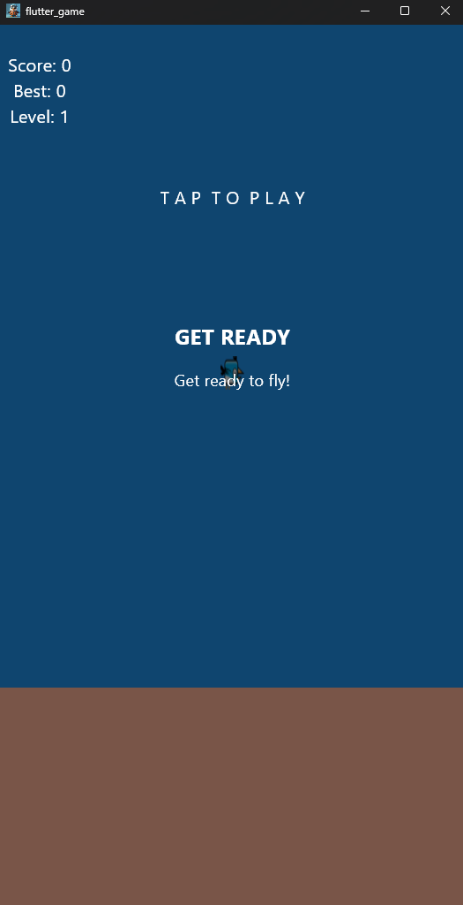
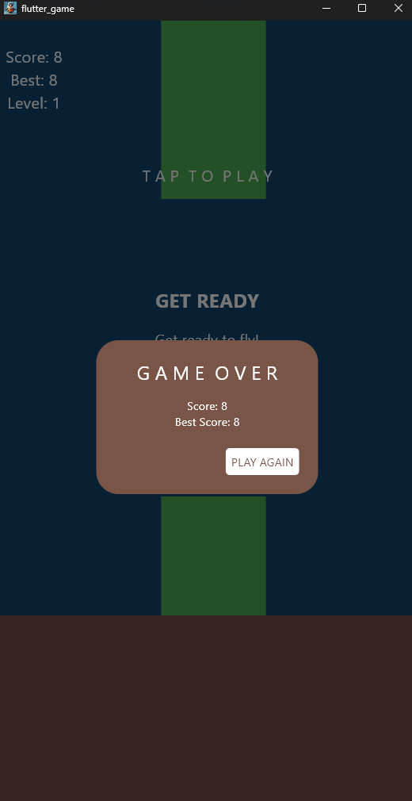
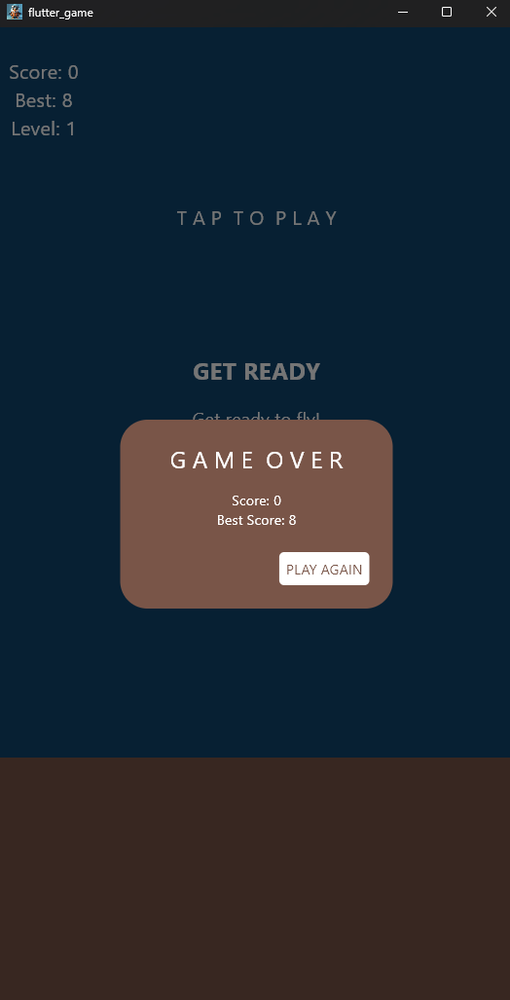
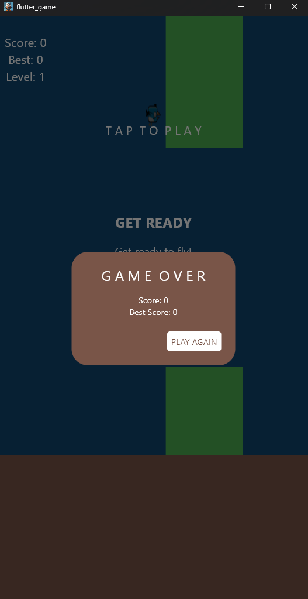

# ShopApp

A simple game Flutter application called "Birdyy"

## Screenshots

<div style="display: flex; justify-content: space-around; align-items: center;">
  
  
  
  
</div>

## Getting Started

This project is a starting point for a Flutter application.

### Prerequisites

Ensure you have the following installed:

- Flutter SDK
- Android Studio or Visual Studio Code with Flutter and Dart plugins

### Installation

1. Clone the repository:
   ```bash
   git clone https://github.com/yourusername/name.git

### Installation

1. Clone the repository:
   ```bash
   git clone https://github.com/yourusername/name.git
   ```
2. Navigate to the project directory:
   ```bash
   cd name
   ```
3. Install dependencies:
   ```bash
   flutter pub get
   ```
4. Run the application:
   ```bash
   flutter run
   ```


Feel free to contribute or provide feedback to improve this application!
